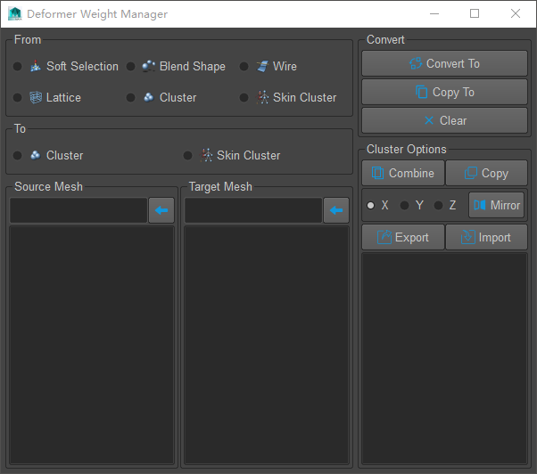

## 变形器权重管理器

* 基于 Maya Python API / PySide 的工具

---

---

#### 功能

* 将多种变形器（SoftMod, BlendShapes, Wire, Lattice）的权重转换/转移到Cluster以及SkinCluster
* 镜像Cluster的权重
* 拷贝，合并多个Cluster的权重
* 导出/导入Cluster的权重

#### 安装

* 将“install.mel”拖放到maya场景中，将在工具架上生成一个新的按钮，点击它启动工具

#### Trello
https://trello.com/b/LItmteef/deform-weight-manager
